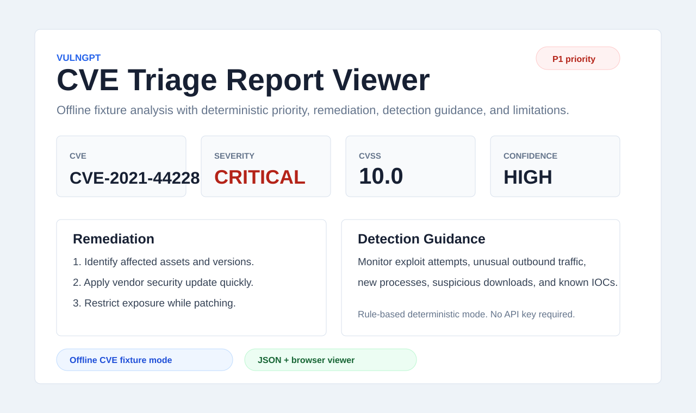

# Project Evidence

This page records reproducible evidence for VulnGPT. The bundled offline
fixture keeps the demo stable so reviewers can evaluate the CVE triage workflow
without relying on live NVD availability or an AI API key.

## Evidence Snapshot



## Technical Evidence

Snapshot verified on July 29, 2026:

- NVD CVE parsing for CVSS, CWE, references, dates, descriptions, and affected
  product context.
- Offline fixture mode for deterministic demos and tests.
- Rule-based exploitation likelihood, triage priority, remediation, detection
  guidance, confidence, and limitations.
- Optional AI narrative path kept separate from deterministic analysis.
- JSON export for tickets, reports, automation, and browser review.
- Static TypeScript report viewer in `web/`.
- Unit tests covering analyst fallback behavior, NVD parsing, CLI JSON export,
  and offline fixture behavior.

## Reproducible Demo

```bash
python3 vulngpt.py CVE-2021-44228 --offline
python3 vulngpt.py CVE-2021-44228 --offline --output web/sample-report.json
```

Expected sample summary:

| Metric | Value |
| --- | ---: |
| CVE | CVE-2021-44228 |
| Severity | CRITICAL |
| CVSS | 10.0 |
| Priority | P1 |
| Confidence | HIGH |

## Browser Viewer

```bash
cd web
python3 -m http.server 8080
```

Open `http://127.0.0.1:8080/` and load the bundled sample report. The viewer
shows severity, likelihood, priority, remediation, detection guidance,
references, and limitations.

## Evidence Boundaries

VulnGPT does not know whether a specific environment is exposed. It does not
replace vendor advisories, emergency change control, asset inventory, EPSS,
SBOM matching, or KEV-style operational context. Its value is turning CVE
metadata into a fast, repeatable first-pass triage report.
